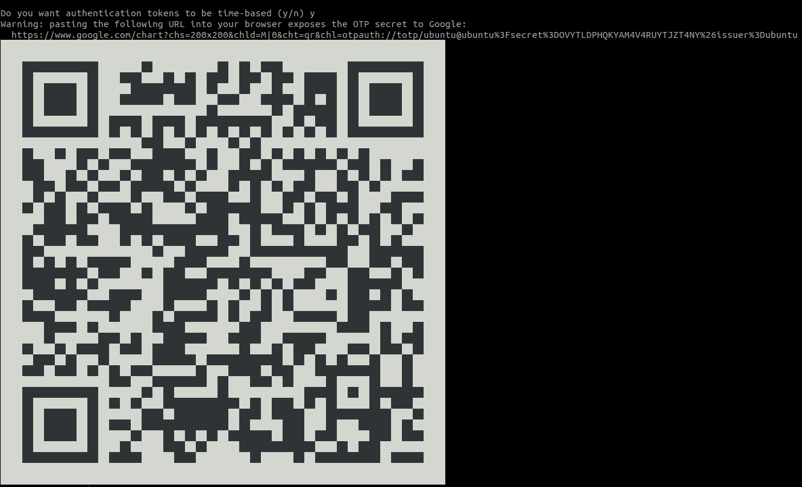

# Añadiendo Google Autenticator 2FA 

> SSH, el shell seguro, se usa a menudo para acceder a sistemas Linux remotos. Debido a que a menudo lo usamos para conectarnos con computadoras que contienen datos importantes, se recomienda agregar otra capa de seguridad. Aquí viene la autenticación de dos factores ( 2FA ).

__¿Qué es la autenticación de dos factores?__

La autenticación multifactor es un método para confirmar su identidad utilizando al menos dos formas diferentes de autenticación. 

El ejemplo más común y más fácil de implementar de autenticación de dos factores utiliza una combinación de frase de contraseña (una contraseña compleja, a menudo formada por varias palabras) y una contraseña de un solo uso generada por una aplicación móvil especial.

Usaremos la aplicación Google Authenticator disponible para Android (Play Store) e iOS (iTunes) para generar códigos de autenticación.

Lo que necesitarás:
- Una computadora con Ubuntu 16.04 LTS o superior
- Un teléfono con Android o iOS
- Una conexión SSH configurada
- Debe comprender el peligro de las contraseñas robadas.

## Instalación y configuración de los paquetes necesarios

Instalación del módulo PAM de Google Authenticator
Inicie una sesión de terminal y escriba:

```sh

sudo apt install libpam-google-authenticator -y

```

## Configuración de SSH

Para hacer que SSH use el módulo PAM de Google Authenticator, agregue la siguiente línea al archivo /etc/pam.d/sshd:

```sh

sudo nano /etc/pam.d/sshd

y al final del fichero agregue:

auth required pam_google_authenticator.so

```

Ahora necesita reiniciar el servicio sshd usando:

```sh

sudo systemctl restart sshd.service

```


Tambien es necesario modificar el fichero /etc/ssh/sshd_config cambie la directiva ChallengeResponseAuthenticationde no a yes, de modo que esta parte del archivo se vea así:

```sh

sudo nano /etc/ssh/sshd_config

y cambiar la directiva

# Change to yes to enable challenge-response passwords (beware issues with
# some PAM modules and threads)
ChallengeResponseAuthentication no # CHANGE THIS TO YES

```

Tras guardar los cambios reiniciamos el servicio sshd


```sh

sudo systemctl restart sshd.service

```

## Configuración de la autenticación

Google Authenticator facilita mucho la configuración de la autenticación de dos factores, en comparación con (por ejemplo) libpam-oath.

En una terminal, ejecute el comando:

```sh

google-authenticator

```


Le hará una serie de preguntas, aquí hay una configuración recomendada:

- Hacer tokens “base de tiempo””: sí
- Actualizar el .google_authenticatorarchivo: sí
- No permitir usos múltiples: sí
- Aumentar el límite de tiempo de generación original: no
- Habilitar limitación de velocidad: sí

Es posible que haya notado el código QR gigante que apareció durante el proceso, debajo están los códigos de emergencia para usar si no tiene acceso a su teléfono: escríbalos en un papel y guárdelos en un lugar seguro.

Eso es todo. Ahora, abramos Google Authenticator y agreguemos nuestra clave secreta para que funcione.

## Iniciando la sesión ssh con 2FA

Tras realizar los ccambios probamos que está habilitada la opción de 2FA, el primer password corresponde al usuario de conexión y el segundo es el valor que nos mostrará la app de Google Authenticator.

```sh

ryzen@ryzen:~$ ssh ubuntu@192.168.1.145
(ubuntu@192.168.1.145) Password: 
(ubuntu@192.168.1.145) Verification code: 

```

